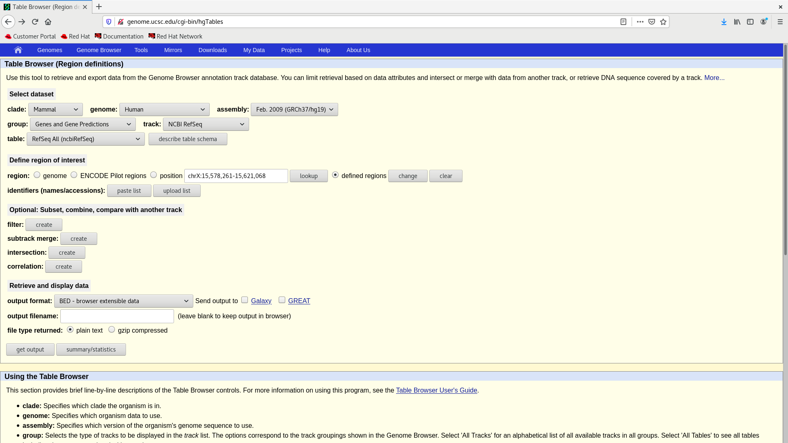

# Directory contents

This directory contains scripts for annotating regions which cause 99 % of the off-target coverage. The initial annotation of the bed file with gene information was performed with [UCSC Table Browser](http://genome.ucsc.edu/cgi-bin/hgTables "Link to the Table browser webb application").

The setup looked like this .

- In the `defined regions` section the `target_bases_not_covered_ROstergotland_Onco_v2_TE-94002956_hg19_150XDS_cutoff_99_0.bed` bed-file was used
- In the `output format` section, three options were used:
  - `all fields from selected tables`
  - `GTF - gene transfer format (limited)`
  - `BED - browser extensible data`

The actual modifications with annotations were performed using the `Makefile` and running programs inside `off-target-annotation` conda environment defined in `env.yml` file.
